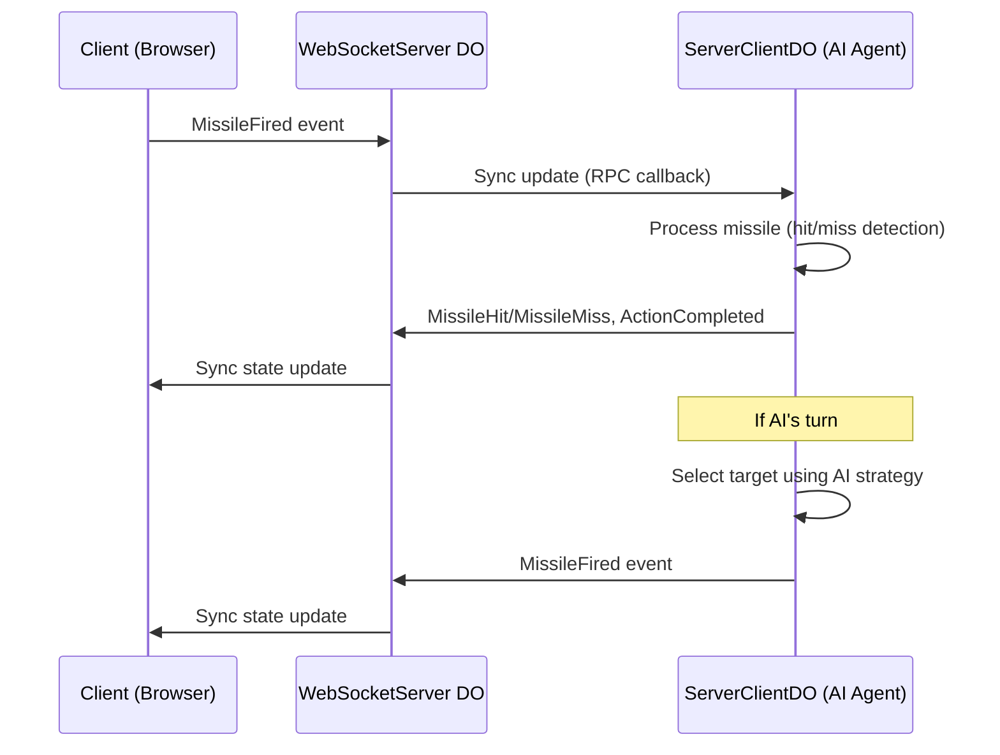
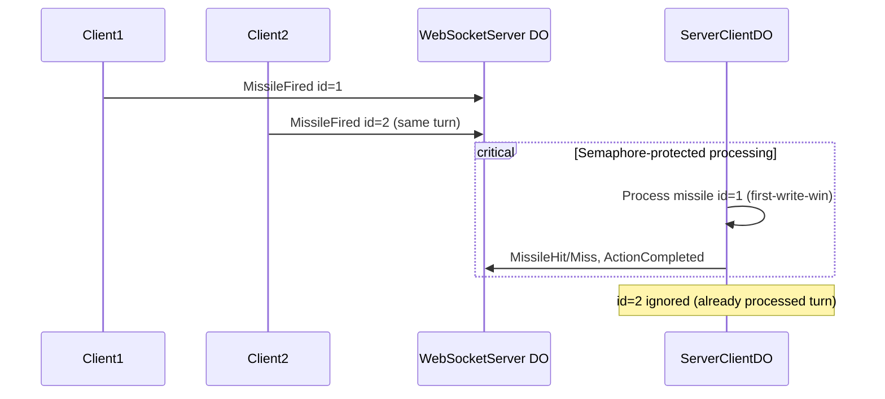

# Battleship

This classical [Battleship](https://en.wikipedia.org/wiki/Battleship_(game)) game is to experiment building turn-based game and AI agents with [LiveStore](https://livestore.dev/)

## Demo
[Live Demo](http://battleship.openhackers.club/) | [Discussion on livestore/livestore](https://github.com/livestorejs/livestore/discussions/593)


## Architecture

With [Livestore](https://docs.livestore.dev/evaluation/how-livestore-works/), the game state is synchronized across multiple browser clients via a Cloudflare Worker with Durable Objects.

The architecture uses two Durable Objects:
- **WebSocketServer**: Handles sync protocol and real-time state synchronization
- **ServerClientDO**: AI agent server that processes missile events and executes AI turns

### Event-driven architecture
- With CQRS & Event-sourcing, client visualizes the latest game state and every action is a command event
- AI Agent (running in ServerClientDO) subscribes to events and takes action (fires missile) whenever it's their turn
- When player fires multiple `MissileFired` events from multiple browsers in a turn, the server decides which counts (first-write-win)
  - Unique `MissileHit` or `MissileMiss` event, `ActionCompleted` and `GameUpdated` events are fired upon confirmation

## Repo Structure

This is a monorepo containing:

### Applications
- **web-app**: React frontend application with TailwindCSS
- **cf-worker**: Cloudflare Worker serving both static assets and sync backend
  - Includes WebSocketServer DO for sync
  - Includes ServerClientDO for AI agent logic

### Packages
- **agent**: Platform-agnostic AI agent logic (strategy, context building, missile processing)
- **domain**: Isomorphic game logic (coordinates, collision, win conditions)
- **schema**: Livestore schema and queries

## GamePlay

- Game phases:
  - Setup Phase: Initial ship placement and game initialization
  - Playing Phase: Active missile firing and combat
  - Finished Phase: Game ends when all ships of one player are sunk

- Parameters:
  - Grid Size, ship count & length

- AI Agents:
  - **Cloudflare AI**: Llama 3.3 70B running on Cloudflare Workers AI
  - **Browser AI**: Gemini Nano running locally in Chrome 138+ (requires model download)
  - Both AI types use strategic prompting to analyze game state and select optimal targets

- Game state:
  - Current game state is unencrypted
  - TODO: encrypt opponent grid at server side

## Deployment

The application is deployed entirely on Cloudflare:
- **cf-worker**: Cloudflare Worker with Durable Objects (sync + AI agent)
- Static assets from web-app are bundled and served via the worker

## Flows

### Game Turn Flow



### Multiple Firing Events (Race Condition Handling)



## Development

### Prerequisites

- Node.js (v18+)
- pnpm (v9+)
- Wrangler CLI (for Cloudflare development)

### Installation

```bash
pnpm install
```

### Running locally

```bash
# Start all services in development mode
pnpm dev

# Or run specific services
pnpm run dev:webapp
```

### Building

```bash
# Build all apps
pnpm build

# Build specific app
pnpm run build:webapp
```

### Testing & Linting

```bash
# Run tests
pnpm test

# Run linting
pnpm lint

# Fix linting issues
pnpm lint:fix

# Type checking
pnpm typecheck
```

### Deployment

```bash
# Deploy all services
pnpm deploy

# Deploy webapp (via cf-worker)
pnpm deploy:webapp
```
