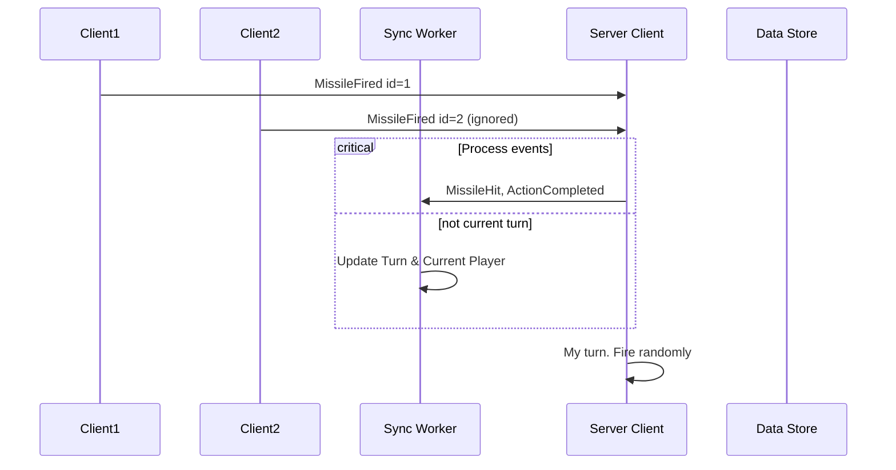
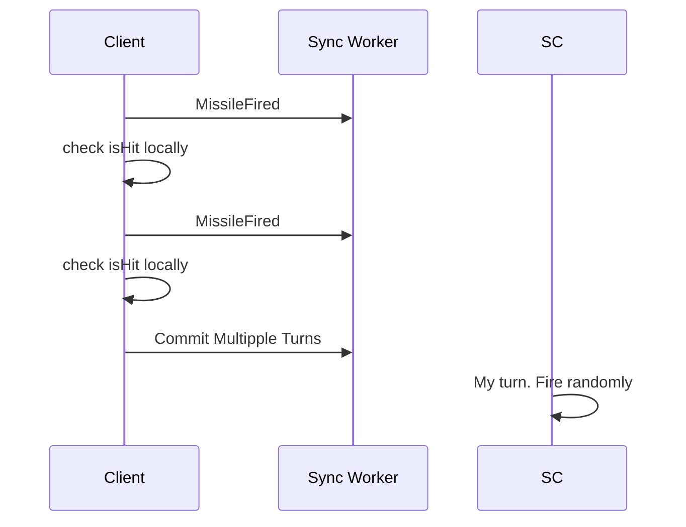

# Battleship

This classical [Battleship](https://en.wikipedia.org/wiki/Battleship_(game)) game is to experiment building turn-based game and AI agents with [LiveStore](https://livestore.dev/)

## Demo
[Live Demo](http://battleship.openhackers.club/) | [Discussion on livestore/livestore](https://github.com/livestorejs/livestore/discussions/593)


## Architecture

With [Livestore](https://docs.livestore.dev/evaluation/how-livestore-works/), the game state is syncrhonized across multiple browser / node clients, with Durable Object based Cloudflare worker 
The Node [serve-rside client](https://docs.livestore.dev/reference/syncing/server-side-clients/) is responsible for confirming action of the turn and pick next player.

### Event-driven architecture
- With CQRS & Event-sourcing, client visualize latest game state and every action is a command event.  
- Opponent (AI Agent) subscribe to events and take action (fire missile) whenever it's its turn. It should have access to current game state.
- When player fire multiple `MissileFired` events from multiple browsers in a turn, the server will decide which count (first-write-win)
  - unique `MissileHit` or `MissileMiss` event, `ActionCompleted` and `GameUpdated` events will be fired upon confirmation and iterate the turn & next player accordingly.


## Repo Structure

This is a monorepo containing:

### Applications
- **web-app**: React frontend application on https://battleship-webapp.pages.dev
- **server-client**: Game server and Node client logic
- **cf-worker**: Cloudflare Worker for synchronization (Ref: https://docs.livestore.dev/reference/syncing/sync-provider/cloudflare/)

### Packages
- **domain**: Isomorphic game logic
- **schema**: Livestore schema and queries
  - Note: currently a copy of schema is kept at webapp due to build error

## GamePlay

- Game phrase
  - Setup Phase: Initial ship placement and game initialization
  - Playing Phase: Active missile firing and combat
  - Finished Phase: Game ends when all ships of one player are sunk

- Parameters
  - Grid Size, ship count & length

- AI Agent
  - Bot at server-side will hit player randomly
  - TODO: integrate local LLM

- Game state
  - Current game state is unencrypted
  - TODO: encrypt opponent grid at server side. 


## Deployment

Currently the sync worker is deployed as Cloudflare Worker
Server client is deployed at Render on https://battleship-server-client.onrender.com/


## Flows


Multiple Firing events




Alternative: Local detection




### Prerequisites

- Node.js
- pnpm
- wrangler

### Installation

```bash
pnpm install
```

### Running locally

```bash
# Start all services in development mode
pnpm dev

# Or run specific services
pnpm run dev:webapp
```

### Building

```bash
# Build all apps
pnpm build

# Build specific app
pnpm run build:webapp
```

### Testing & Linting

```bash
# Run tests
pnpm test

# Run linting
pnpm lint

# Fix linting issues
pnpm lint:fix

# Type checking
pnpm typecheck
```

### Deployment

```bash
# Deploy all services
pnpm deploy

# Deploy specific service
pnpm deploy:webapp
pnpm deploy:server-client
```
